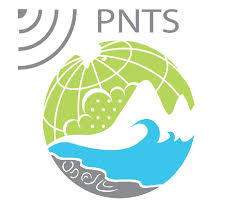

# ASP-SAR

Processing tool package written in bash and python for image correlation of coregistered SAR images using the AMES stereo toolbox (https://stereopipeline.readthedocs.io/en/latest/). The coregistration is done using the AMSTer toolbox(https://github.com/AMSTerUsers/AMSTer_Distribution/).\
The processing chain additionally compute the time series analysis with NSBAS .



# To download the package

# Installation

# How to use it
# AMSTer Toolbox coregistration
1. Coregister SAR images using ALL2GIF.sh of AMSTer toolbox

```bash
ALL2GIF.sh 20220723 /path-to-LaunchParam.txt 100 100
```

2. Prepare list pair table for correlation:

```bash
lns_All_Img.sh /data/processing/AMSTer/SAR_CSL/TSX/Nepal_Desc_105/Crop_MATHILO_28.44-28.38_84.38-84.44 /data/processing/ASP-SAR/nepal/TSX/Nepal_Desc_105
```

```bash
Prepa_MSBAS.sh /data/processing/ASP-SAR/nepal/TSX/Nepal_Desc_105 300 120 20230506
```

Eventually use Delaunay triangulation:

```bash
DelaunayTable.sh -Ratio=r -BpMax=bp -BtMax=bt
```

# Correlations with ASP Toolbox
3. Initialize the AMSTer link with asp-sar

```bash
amster2aspsar.py --amster=/full-path/AMSTer/SAR_SM/AMPLITUDES/SAT/TRK/REGION --aspsar=/full-path/working-dir [--s1]
```

4. Use ASPeo (ASP workflow) for launching the correlation

```bash
aspeo new aspsar_s1.toml
```

```bash
aspeo pt aspeo.toml
```

# Export and prepare for time series inversion
5. Prepare for nsbas

```bash
aspsar2nsbas.py
```

6. Run inversion in WORKING_DIR/NSBAS_PROCESS/MASKED/H|V

```bash
invers_pixel < input_inv_send
```

# Geocoding of cube file or single NSBAS results
7. retrieve geocoded results

```bash
am_geocode.py --amster-dir=<amster-dir> --param=<param> --infile=<infile> --outdir=<outdir>
```
